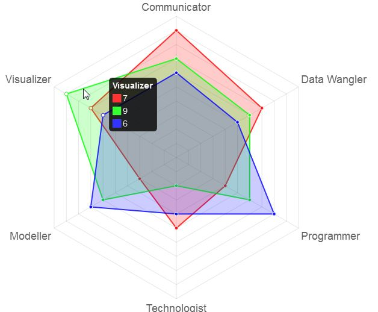
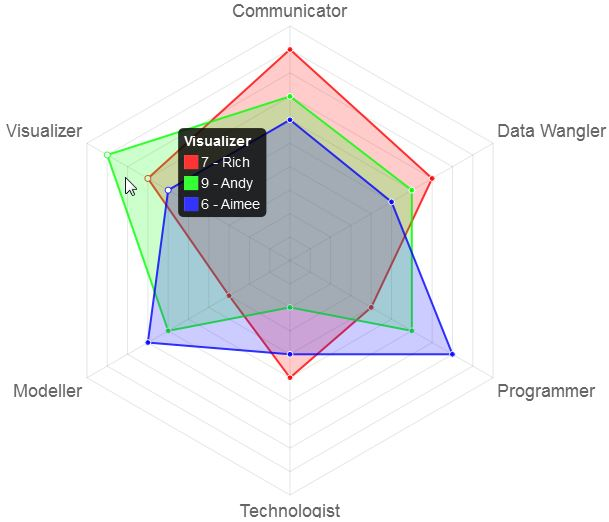
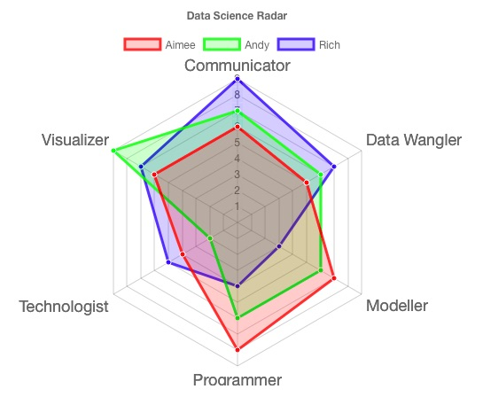

# radarchart

[](https://travis-ci.org/MangoTheCat/radarchart) [](https://ci.appveyor.com/project/MangoTheCat/radarchart) [](http://www.r-pkg.org/pkg/radarchart)
[](https://codecov.io/gh/MangoTheCat/radarchart)
[](http://www.r-pkg.org/pkg/radarchart)
[](http://www.r-pkg.org/pkg/radarchart)


An R implementation of the radar chart from the [chart.js](http://www.chartjs.org/) javascript library.

## Installation

You can install from CRAN.
```r
install.packages("radarchart")
```

To install the latest version direct from GitHub you'll need devtools installed. Assuming you have this run:
```r
devtools::install_github("MangoTheCat/radarchart")
```

Or if you want to hack about with the code then clone the repository, change directory into it and run
```r
devtools::install()
```

Note: `htmlwidgets` packages don't work well with `devtools::load_all()`.

## Usage

Once installed you can make a radar chart

```r
library(radarchart)

labs <- c("Communicator", "Data Wangler", "Programmer",
          "Technologist",  "Modeller", "Visualizer")

scores <- list(
  "Rich" = c(9, 7, 4, 5, 3, 7),
  "Andy" = c(7, 6, 6, 2, 6, 9),
  "Aimee" = c(6, 5, 8, 4, 7, 6)
)

chartJSRadar(scores = scores, labs = labs, maxScale = 10)
```

<p class="caption">Static version. Real plots are interactive</p>

Alternatively, you may supply a data frame and `chartJSRadar` will pickup the labels from the first column of the data. Also we're showing an option to display data set labels in the mouse over.

```r
scores <- data.frame("Label"=c("Communicator", "Data Wangler", "Programmer",
                     "Technologist",  "Modeller", "Visualizer"),
                     "Rich" = c(9, 7, 4, 5, 3, 7),
                     "Andy" = c(7, 6, 6, 2, 6, 9),
                     "Aimee" = c(6, 5, 8, 4, 7, 6))

chartJSRadar(scores, maxScale = 10, showToolTipLabel=TRUE)
```

<p class="caption">Static version. Real plots are interactive</p>

You can now also add a title

```r
chartJSRadar(skills, main = "Data Science Radar")
```

<p class="caption">Static version. Real plots are interactive</p>

## Shiny

As it's based on htmlwidgets it's easy to use `radarchart` with Shiny. Just use the 

```r
chartJSRadarOutput("ID", width = "450", height = "300")
```
function in your `ui.R` and call `chartJSRadar` as normal in your `server.R`. A minimal example can be found in [`inst/shiny-examples/basic`](https://github.com/MangoTheCat/radarchart/tree/master/inst/shiny-examples/basic). You can run this with the `runExampleApp` function

```r
runExampleApp("basic")
```

An `"options"` app is available to help construct more customised radar charts.

## License

MIT © Mango Solutions, Nick Downie
